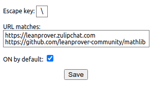

# chrome-lean-unicode

This extension allows you to type Lean unicode characters on your browser
similarly to programming environments.

Might be particularly useful on Zulip and GitHub.

## Installing

1. Clone this repository
2. Visit [chrome://extensions/](chrome://extensions/)
3. Switch to `Developer mode`
4. Click on `Load unpacked` and select the cloned directory
5. Optional (recommended): pin the extension in your browser

## Usage

You can see the extension settings popup by clicking on its icon.



Example settings:
```
https://leanprover.zulipchat.com
https://github.com/leanprover-community/mathlib
```

With the settings above, whenever you type in `\a` and then hit space, the
extension will replace `\a` by `α`.

This behavior is only triggered in pages whose URLs start with the strings
listed in the `URL matches` field.

The `ON by default` option allows you to configure the extension to be active
or inactive when you visit those pages.

Hitting `ALT` twice switches the extension state between active and inactive.
You should see the extension icon changing colors if you're visiting a page
listed in the URLs field.
